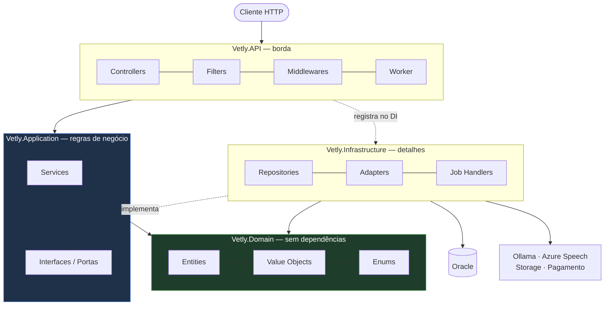
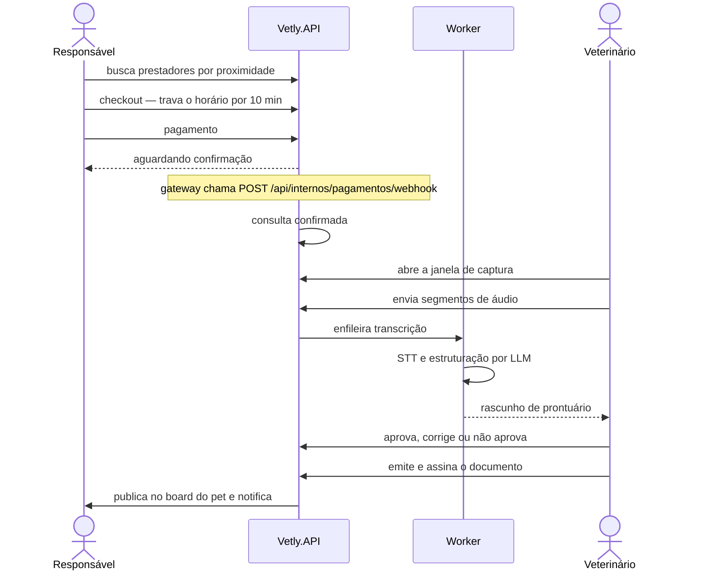

# Vetly API

**Plataforma que conecta responsáveis de pets a clínicas e veterinários autônomos — agendamento, pagamento com split, prontuário assistido por IA e fidelidade em uma única API.**

`.NET 10` · `ASP.NET Core` · `EF Core 10` · `Oracle` · `~1.000 testes automatizados`

O ciclo completo do produto vive aqui: busca por proximidade, agenda com controle de concorrência, cobrança antecipada, captura de áudio da consulta, estruturação do prontuário por LLM, emissão de documentos assinados e programa de pontos.

A tese que organiza o código é uma só: **o prontuário pertence ao animal, não à clínica.** Dela decorrem o consentimento granular, a autorização de acesso com prazo e escopo, e a trilha de acesso append-only visível ao responsável.

Esta é uma implementação de **MVP**, e o código diz isso abertamente. Não há gateway de pagamento real — a cobrança é simulada, e nota fiscal e split são registrados, não liquidados. Toda dependência externa entra por uma **porta** na camada de Aplicação e sai por um adaptador escolhido em configuração; trocar simulado por real é trocar um registro no contêiner de DI.

---

## 1. Início rápido

### Pré-requisitos

| Requisito | Necessidade |
|---|---|
| .NET 10 SDK | obrigatório |
| Oracle 21c+ | obrigatório |
| [Ollama](https://ollama.com) com `llama3.1` | **opcional** — sem ele apenas as rotas `/api/ia` param e `/health/ready` responde `Degraded` |

### Configuração

Crie `src/Vetly.API/appsettings.Development.local.json` — o padrão `appsettings.*.local.json` já está no [.gitignore](.gitignore), então o arquivo não vai para o repositório:

```json
{
  "ConnectionStrings": {
    "OracleConnection": "User Id=USUARIO;Password=SENHA;Data Source=host:1521/orcl"
  },
  "Jwt": {
    "Key": "uma-chave-com-no-minimo-32-caracteres"
  },
  "Servicos": {
    "TokenInterno": "um-token-qualquer-para-as-rotas-internas"
  }
}
```

`Jwt:Key` é o único item verificado explicitamente no arranque — sem ela, [Program.cs](src/Vetly.API/Program.cs) lança `InvalidOperationException` antes de a API subir. `Servicos:TokenInterno` autentica as rotas `POST /api/internos/*` (webhook de pagamento e callback de transcrição).

### Execução

```bash
dotnet restore
dotnet ef database update --project src/Vetly.Infrastructure --startup-project src/Vetly.API
dotnet run --project src/Vetly.API --launch-profile https
```

As migrations **não** são aplicadas na inicialização: não há `Database.Migrate()` no código. O passo é manual e deliberado — nenhuma instância altera o schema por conta própria ao subir.

### Endereços

| URL | O que é |
|---|---|
| `https://localhost:7262/scalar/v1` | Documentação interativa (Scalar) |
| `https://localhost:7262/openapi/v1.json` | Documento OpenAPI |
| `/health` · `/health/live` · `/health/ready` | Health checks (todos · liveness · readiness) |
| `/metrics` | Métricas em formato Prometheus |

Porta HTTP alternativa: `5140` (perfil `http`), definida em [launchSettings.json](src/Vetly.API/Properties/launchSettings.json).

### Testes

```bash
dotnet test
```

Roda numa máquina recém-clonada, **sem Oracle e sem Ollama** — os testes de integração sobem a API em memória e os adaptadores default são simulados.

---

## 2. Arquitetura

Quatro camadas, com a regra de dependência apontando sempre para dentro.



Nenhuma seta sai do `Domain`. Ele não referencia projeto nem pacote algum — nem EF Core, nem as abstrações de logging da Microsoft. O mapeamento para o Oracle vive inteiramente na Infrastructure, em classes `IEntityTypeConfiguration<T>`.

| Camada | Conteúdo | Referencia |
|---|---|---|
| **Vetly.API** | 24 controllers (~147 endpoints), 3 filtros globais, 3 middlewares, 4 health checks, worker hospedado | Application, Infrastructure |
| **Vetly.Infrastructure** | EF Core + Oracle, 33 DbSets, 31 migrations, 27 configurations, 24 repositórios, 9 adaptadores | Application, Domain |
| **Vetly.Application** | 29 serviços, 62 interfaces, 71 arquivos de DTO | Domain + 2 pacotes `*.Abstractions` |
| **Vetly.Domain** | 31 entidades, 36 enums, 6 value objects | **nada** |

### Portas e adaptadores

Tudo que a Aplicação precisa do mundo externo é declarado como interface em [Interfaces/](src/Vetly.Application/Interfaces/) e implementado em [Adapters/](src/Vetly.Infrastructure/Adapters/). A escolha da implementação é feita por configuração, no arranque.

| Chave | Padrão | Valores aceitos |
|---|---|---|
| `Adaptadores:Stt` | `Simulado` | `Simulado`, `NodeRed`, `Azure` |
| `Adaptadores:Storage` | `Local` | `Local` |
| `Adaptadores:Assinatura` | `NomeDigitado` | `NomeDigitado` |
| `Adaptadores:Pagamento` | `Simulado` | `Simulado` |
| `Adaptadores:Crmv` | `Simulado` | `Simulado` |
| `Adaptadores:Push` | `Simulado` | `Simulado` |
| `Adaptadores:Geocodificacao` | `Simulado` | `Simulado` |

Um valor não reconhecido **derruba a aplicação no arranque**. Não existe fallback silencioso: uma configuração errada falha no deploy, não em produção às três da manhã.

### Padrões de projeto

| Padrão | Onde | O que resolve |
|---|---|---|
| **Strategy** | [Strategies/Cancelamento/](src/Vetly.Application/Strategies/Cancelamento/) | Reembolso por faixa de antecedência. A mesma strategy atende a simulação e o cancelamento real — mostrar um valor e cobrar outro fica impossível por construção |
| **Strategy + Template Method** | [Strategies/Split/](src/Vetly.Application/Strategies/Split/) | Take rate por plano. A classe base concentra a aritmética e deriva o repasse por subtração, para comissão e repasse sempre somarem o bruto |
| **Factory** | [Factories/](src/Vetly.Application/Factories/) | Prontuário, receita, atestado e nota fiscal. A factory formata o estado final aprovado; não infere conteúdo clínico |
| **Repository** | [Repositories/](src/Vetly.Infrastructure/Repositories/) | `IRepositoryBase<T>` genérico + 23 concretos. O de auditoria de IA não expõe update nem delete |

### Estrutura

```
src/
├── Vetly.Domain/           Entities · Enums · ValueObjects
├── Vetly.Application/      Services · Interfaces · DTOs · Factories
│                           Strategies · Exceptions · Observability
├── Vetly.Infrastructure/   Data (DbContext, Configurations) · Migrations
│                           Repositories · Adapters · Jobs · Security
└── Vetly.API/              Controllers · Filters · Middlewares
                            HealthChecks · Observability · Jobs · Security
tests/
├── Vetly.UnitTests/        43 arquivos — regras de negócio isoladas
└── Vetly.IntegrationTests/ 26 arquivos — API completa em memória
```

---

## 3. Fluxo do atendimento

O caminho crítico, do agendamento ao documento publicado:



- **A confirmação do pagamento vem só do webhook**, nunca da resposta síncrona da cobrança.
- **A IA sugere; o veterinário decide.** Toda decisão vira registro append-only com o conteúdo final, o autor e o modelo usado.
- **Fora da janela de captura nada é gravado nem gerado.** Quem abre e fecha a janela é o veterinário.

---

## 4. Autenticação

JWT Bearer com refresh token rotativo — cada uso invalida o anterior. Senhas em PBKDF2-HMAC-SHA256 com 210.000 iterações e salt por usuário.

| Perfil | Acesso |
|---|---|
| `Tutor` | Responsável pelo animal: busca, agenda, paga, autoriza acesso ao histórico, avalia |
| `Veterinario` | Agenda, atende, valida diagnóstico, emite e assina documentos |
| `Admin` | Administra a clínica: cadastra veterinários, define plano e consolidado financeiro |
| `VetDesativado` | Bloqueado em toda rota de negócio; mantém apenas o próprio extrato |

As policies registradas são `ApenasAdmin`, `VeterinarioOuAdmin`, `ApenasTutor` e `TutorOuAdmin`.

Três filtros globais rodam antes de qualquer controller e **falham fechado** — na dúvida, negam: consentimento LGPD ([ConsentimentoAtendimentoFilter](src/Vetly.API/Filters/ConsentimentoAtendimentoFilter.cs)), bloqueio de veterinário desativado ([VetDesativadoFilter](src/Vetly.API/Filters/VetDesativadoFilter.cs)) e idempotência ([IdempotencyFilter](src/Vetly.API/Filters/IdempotencyFilter.cs)).

---

## 5. Observabilidade

| Check | Falha como | Tag |
|---|---|---|
| `api` | — | `live` |
| `oracle-db` | `Unhealthy` | `ready` |
| `ollama` | `Degraded` | `ready` |
| `azure-speech` | `Degraded` | `ready` (só com `Adaptadores:Stt=Azure`) |

Dependência de IA indisponível **degrada, não derruba**: a consulta continua acontecendo com prontuário manual.

Logs estruturados via Serilog em console e arquivo (`src/Vetly.API/logs/vetly-AAAAMMDD.log`, rotação diária, 14 dias retidos, JSON compacto). Traces e métricas via OpenTelemetry, expostos em `/metrics` no formato Prometheus; para enviar a um coletor externo, basta preencher `OpenTelemetry:Otlp:Endpoint`.

**Rastreabilidade de regra de negócio.** Quando uma regra é violada, a resposta traz um código no `ProblemDetails`:

```json
{ "status": 409, "codigo": "RN-035", "detail": "Horario ja reservado." }
```

Esse mesmo `RN-035` é a chave em [REGRAS-DE-NEGOCIO.md](REGRAS-DE-NEGOCIO.md) — onde a regra está descrita e a classe que a implementa está nomeada — e é o label da métrica `vetly_regras_violadas_total{codigo}`. Um alerta no Prometheus leva ao arquivo de código sem adivinhação no meio do caminho.

---

## 6. Testes

xUnit com Moq. Asserções nativas, sem biblioteca de fluência.

| Suíte | Arquivos | O que cobre |
|---|---|---|
| `Vetly.UnitTests` | 43 | Regras de negócio isoladas, um arquivo por serviço |
| `Vetly.IntegrationTests` | 26 | API real via `WebApplicationFactory` — pipeline, filtros, auth e worker |

```bash
dotnet test                                              # tudo
dotnet test tests/Vetly.UnitTests                        # uma suíte
dotnet test --filter "FullyQualifiedName~FidelidadeTests"

dotnet test --collect:"XPlat Code Coverage" --settings coverlet.runsettings
```

O [coverlet.runsettings](coverlet.runsettings) exclui as migrations geradas — sem esse filtro, ~7 mil linhas de código gerado afundam a cobertura da Infrastructure.

**O limite conhecido:** os testes de integração usam EF InMemory, que não traduz SQL. Consultas válidas em LINQ podem falhar no Oracle real — foi o que aconteceu com um `AnyAsync` que virou `ORA-00904`. A defesa é uma guarda estática (`CompatibilidadeComOracleTests`) que varre o fonte da Infrastructure atrás dos padrões que já quebraram, mais um smoke manual contra o banco real antes de entregar.

---

## Documentos relacionados

[REGRAS-DE-NEGOCIO.md](REGRAS-DE-NEGOCIO.md) — catálogo RN-001 a RN-107, cada regra ligada à classe e ao método que a implementa.

[ROTEIRO-POSTMAN.md](ROTEIRO-POSTMAN.md) — a jornada completa no Postman, com os corpos de requisição prontos para copiar e colar.

Todo o código está em português, incluindo os XML docs, que explicam o *porquê* de cada decisão e não apenas o *o quê*.

Projeto acadêmico desenvolvido para a disciplina **Advanced Business Development with .NET**.
