# Vetly API — v2

A Vetly é uma plataforma que conecta Responsáveis de pets a veterinários (autônomos ou
vinculados a clínicas/empresas), cobrindo o ciclo completo: agendamento com máquina de
estados e pagamento simulado, prontuário com "colmeia" de acesso por evento clínico
(compartilhamento de histórico entre vets, respeitando LGPD), IA assistente na consulta
(diagnóstico, protocolo, triagem — sempre validada pelo veterinário), documentos com
assinatura por nome digitado, avaliação e notoriedade, fidelidade (obrigações do pet,
pontos, tiers, desconto), e um dashboard financeiro consolidado para administradores de
empresa.

Esta é a **v2** da API — uma migração incremental sobre a v1, executada em 13 fases
(0 a 13), cada uma com Domain → Application → Infrastructure (+ migration EF) → API →
Tests. O histórico completo de decisões de arquitetura, o que foi feito em cada fase e
por quê, está em [`AGENT-OBJECTIVES.md`](./AGENT-OBJECTIVES.md). A especificação de
origem (documento de produto + documento técnico com as regras de negócio RN-001 a
RN-107) está salva em [`docs/v2-spec/`](./docs/v2-spec/) para consulta.

> **O que este MVP não faz** (mockado ou fora de escopo — nunca implementado nesta
> migração): busca por geolocalização/matching, notificações reais (push/WhatsApp — só
> o fato é registrado no domínio), marketplace real (parceiros, pedidos), liquidação
> financeira real (pagamento é sempre simulado, nunca dispara Pix/cartão de verdade),
> assinatura digital ICP-Brasil (MVP usa nome digitado), monetização de dados,
> integrações Enterprise (labs, NFS-e, ERPs), emergência/SOS, mapa visual. Ver a seção
> "FORA DE ESCOPO" completa em `AGENT-OBJECTIVES.md`.

## Stack

| Camada | Tecnologia |
|---|---|
| Framework | ASP.NET Core 10 (Web API) |
| ORM | EF Core 10 + Oracle.EntityFrameworkCore |
| Banco | Oracle Database 21c+ |
| Autenticação | JWT Bearer (dev-stub — ver seção "Como autenticar") |
| Documentação interativa | Scalar (tema DeepSpace) em `/scalar/v1` |
| IA | Ollama local (modelo `llama3.1`) |
| Testes | xUnit + Moq — **237 testes verdes** (231 unit + 6 integration) |
| Serialização | Enums como string no JSON (`"finalidade": "CompartilhamentoRede"`) |

## Arquitetura e padrões aplicados

Clean Architecture em 4 projetos: `Vetly.Domain` (entidades ricas, sem dependências
externas) → `Vetly.Application` (services, interfaces de repositório, DTOs, Strategies,
Factories) → `Vetly.Infrastructure` (EF Core, repositórios, migrations) e `Vetly.API`
(controllers, middlewares, DI). Toda mutação de estado passa por método de domínio —
nunca setter público — e invariantes violadas lançam `DomainException` (`Vetly.Domain`)
ou `BusinessRuleException`/`ForbiddenException` (`Vetly.Application`), sempre mapeadas
pelo `ExceptionHandlingMiddleware` para `ProblemDetails` (RFC 7807).

| Padrão | Onde |
|---|---|
| Factory Pattern | `IDocumentoFactory` — `DocumentoService` seleciona pelo `TipoDocumento` |
| Factory Pattern | `IObrigacaoFactory` — `ObrigacaoService` seleciona pela espécie do animal (canina/felina/genérica) |
| Strategy Pattern | `ICancelamentoStrategy` — `ConsultaService` seleciona por antecedência (RN-019/020/021) |
| Strategy Pattern | `ISplitFinanceiroStrategy` — `PagamentoService` seleciona pela `PersonaVeterinario` |
| Strategy Pattern | `IComissaoStrategy` — `PagamentoService` seleciona pelo `PlanoAssinatura` do vet (RN-089) |
| Strategy Pattern | `IDescontoFidelidadeStrategy` — `FidelidadeService` seleciona pelo `TierFidelidade` (RN-072) |
| Repository Pattern | Interfaces em `Vetly.Application.Interfaces`; implementações EF Core em `Vetly.Infrastructure.Repositories` |
| DIP | Todo service depende de interfaces — zero acoplamento concreto entre camadas |
| Soft Delete | `Veterinario`, `Animal`, `Responsavel`, `Empresa` são desativados, nunca deletados |
| Value Object | `Crmv` — imutável, valida regex `^\d{4,6}-[A-Z]{2}$` |
| ProblemDetails | `ExceptionHandlingMiddleware` retorna RFC 7807 em todos os erros, com `codigo` e `correlationId` |
| Claim de posse | `ICurrentUserService` lê `entidadeId`/role do JWT para checagens de autorização por posse (RN-001..007) |

---

## Instalação e como rodar

**Pré-requisitos:**

- .NET 10 SDK
- Oracle Database 21c+ acessível (a connection string padrão aponta para `oracle.fiap.com.br:1521/orcl`)
- Ollama instalado e rodando — baixar em https://ollama.com/download, depois:

```bash
ollama serve
ollama pull llama3.1
```

Validar:

```bash
curl -X POST http://localhost:11434/api/generate \
  -H "Content-Type: application/json" \
  -d '{"model":"llama3.1","prompt":"ola","stream":false}'
```

**Configuração** — crie o arquivo `src/Vetly.API/appsettings.Development.local.json` com suas credenciais Oracle:

```json
{
  "ConnectionStrings": {
    "OracleConnection": "User Id=SEU_USUARIO;Password=SUA_SENHA;Data Source=oracle.fiap.com.br:1521/orcl"
  },
  "Jwt": {
    "Key": "VetlySecretKey_MustBeAtLeast32CharactersLong!",
    "Issuer": "Vetly",
    "Audience": "VetlyApi"
  },
  "Ollama": {
    "BaseUrl": "http://localhost:11434",
    "Model": "llama3.1",
    "TimeoutSeconds": 120
  }
}
```

> Este arquivo está no `.gitignore` e **não é commitado**. Substitua `SEU_USUARIO` e `SUA_SENHA` pelas suas credenciais Oracle.

**Rodar:**

```bash
# 1. Restaurar e compilar
dotnet restore
dotnet build

# 2. Aplicar migrations no Oracle (12 migrations, InitialCreate + Fase01..Fase12)
dotnet ef database update \
  --project src/Vetly.Infrastructure \
  --startup-project src/Vetly.API

# 3. Subir a API (HTTPS na porta 7262)
dotnet run --project src/Vetly.API --launch-profile https

# 4. Abrir documentação interativa
# https://localhost:7262/scalar/v1

# 5. Rodar os testes (237 testes: 231 unit + 6 integration)
dotnet test
```

Para um roteiro completo de teste ponta a ponta via `curl`, veja
[`FLUXO-DE-TESTE.md`](./FLUXO-DE-TESTE.md).

---

## Como autenticar

Todos os endpoints exigem JWT, exceto `POST /api/auth/token`.

```bash
curl -X POST https://localhost:7262/api/auth/token \
  -H "Content-Type: application/json" \
  -d '{"usuario":"admin-teste","role":"Admin"}'
```

Roles disponíveis: `Admin`, `Veterinario`, `Responsavel`. Endpoints de criação e
desativação de veterinários exigem role `Admin` (policy `ApenasAdmin`).

**`entidadeId` opcional** — este é um stub de desenvolvimento: o token é emitido a
partir de `{usuario, role}` livre, sem validar contra um cadastro real. Para exercitar
as checagens de autorização por posse (RN-001..007) — "vet só vê a própria agenda",
"admin só vê a própria empresa" —, informe `entidadeId` com o `Guid` real do
veterinário (role `Veterinario`) ou da empresa (role `Admin`):

```bash
curl -X POST https://localhost:7262/api/auth/token \
  -H "Content-Type: application/json" \
  -d '{"usuario":"vet-joao","role":"Veterinario","entidadeId":"11111111-1111-1111-1111-111111111111"}'
```

Sem `entidadeId`, os endpoints que checam posse não bloqueiam — degradação graciosa
para permitir testar o resto da API sem montar um cadastro completo primeiro.

Use o token retornado com `Authorization: Bearer {token}` nas demais chamadas.

---

## Contratos da API

Todas as respostas de erro seguem RFC 7807 (`ProblemDetails`):

```json
{
  "status": 422,
  "title": "Regra de negocio violada",
  "detail": "O responsavel precisa ter o consentimento de atendimento clinico ativo para agendar consultas.",
  "codigo": "LGPD-001",
  "correlationId": "0HN..."
}
```

### Auth

| Método | Rota | Auth | Descrição |
|---|---|---|---|
| POST | `/api/auth/token` | Pública | Gera token JWT. Body: `{ usuario, role, entidadeId? }`. Resposta: `{ token, role, expiraEm }` |

### Veterinários

| Método | Rota | Auth | Descrição |
|---|---|---|---|
| GET | `/api/veterinarios` | JWT | Lista todos ativos — inclui `notaMedia`/`totalAvaliacoes` (RN-078), `strikesAtivos`/`suspensoAte` (RN-067) |
| GET | `/api/veterinarios/{id}` | JWT | Detalhe |
| GET | `/api/veterinarios/regiao/{uf}` | JWT | Por UF (ex: SP, RJ) |
| GET | `/api/veterinarios/{id}/agenda` | JWT | Agenda futura — **403 `ACESSO-002`** se o chamador for outro vet (RN-001..006) |
| GET | `/api/veterinarios/{id}/concessoes` | JWT | Concessões de acesso à colmeia ativas do vet (RN-083, uso administrativo) |
| GET | `/api/veterinarios/{id}/avaliacoes` | JWT | Avaliações não invalidadas recebidas (RN-076..081) |
| POST | `/api/veterinarios` | Admin | Cadastrar — CRMV validado por regex + duplicidade (RN-011) |
| PUT | `/api/veterinarios/{id}` | JWT | Atualizar dados/plano |
| DELETE | `/api/veterinarios/{id}` | Admin | Desativar — retorna agendamentos futuros afetados (RN-008) |

`CriarVeterinarioDto`: `nome`, `crmv` (`XXXXXX-UF`), `ufAtuacao`, `persona`
(`Autonomo`\|`Vinculado`), `plano` (`Basico`\|`Profissional`\|`Enterprise`),
`especialidades[]`, `especiesAtendidas[]`, `titulacaoAcademica?`.

### Animais

| Método | Rota | Auth | Descrição |
|---|---|---|---|
| GET | `/api/animais` | JWT | Lista todos ativos |
| GET | `/api/animais/{id}` | JWT | Detalhe |
| GET | `/api/animais/{id}/prontuarios` | JWT | Histórico longitudinal — completo (colmeia ativa/Responsável), restrito (só o que o vet produziu) ou **403 `ACESSO-001`** (RN-010/083) |
| GET | `/api/animais/{id}/log-acessos` | JWT | Log de todo acesso ao prontuário (RN-086) |
| GET | `/api/animais/{id}/exames` | JWT | Exames do animal |
| GET | `/api/animais/{id}/obrigacoes` | JWT | Calendário de obrigações — `atrasada` derivada, não persistida (RN-069/070) |
| POST | `/api/animais` | JWT | Cadastrar |
| POST | `/api/animais/{id}/obrigacoes` | JWT | Gera o calendário via Factory por espécie — **422 `OBRIGACAO-002`** se já existir (RN-069) |
| POST | `/api/animais/{id}/ocultar-registro` | JWT | Oculta um prontuário — **422 `ANIMAL-002`** se for alerta de segurança (RN-088) |
| PUT | `/api/animais/{id}` | JWT | Atualizar |
| PUT | `/api/animais/{id}/peso` | JWT | Atualiza peso — **400** se `pesoKg <= 0` (RN-096.2) |
| DELETE | `/api/animais/{id}` | JWT | Desativar (soft delete) |
| DELETE | `/api/animais/{id}/ocultar-registro/{prontuarioId}` | JWT | Reexibe um prontuário ocultado |

`CriarAnimalDto`: `nome`, `especie`, `raca`, `sexo` (`Macho`\|`Femea`),
`dataNascimento`, `responsavelId`, `castrado?`, `pesoKg?`, `fotoUrl?`,
`condicoesPreExistentes[]`, `alergias[]`, `carteiraVacinacao[]`, `medicacoesEmUso[]`.

### Responsáveis

| Método | Rota | Auth | Descrição |
|---|---|---|---|
| GET | `/api/responsaveis` | JWT | Lista todos ativos |
| GET | `/api/responsaveis/{id}` | JWT | Detalhe — inclui `tierFidelidade`, `saldoPontos`, `saldoCreditosVetly`, `noShowsAtivos`, `bloqueadoDescontosAte` |
| GET | `/api/responsaveis/{id}/animais` | JWT | Animais cadastrados |
| GET | `/api/responsaveis/{id}/consentimentos` | JWT | Histórico completo de consentimentos LGPD (RN-041..044) |
| GET | `/api/responsaveis/{id}/fidelidade` | JWT | Tier, saldo de pontos e pontos para o próximo tier (RN-071) |
| GET | `/api/responsaveis/{id}/fidelidade/extrato` | JWT | Extrato completo de lançamentos de pontos (RN-070/074/075) |
| POST | `/api/responsaveis` | JWT | Cadastrar |
| POST | `/api/responsaveis/{id}/consentimentos` | JWT | Concede consentimento para uma finalidade — sempre cria novo registro (RN-041..043) |
| PUT | `/api/responsaveis/{id}` | JWT | Atualizar |
| DELETE | `/api/responsaveis/{id}` | JWT | Desativar (soft delete + anonimização LGPD) |
| DELETE | `/api/responsaveis/{id}/consentimentos/{finalidade}` | JWT | Revoga consentimento ativo — preserva histórico (RN-044) |

`CriarResponsavelDto`: `nome`, `email`, `telefone`.
`ConcederConsentimentoDto`: `finalidade` (ver enum `FinalidadeConsentimento`).

### Consultas

Máquina de estados: `EmCheckout → Confirmada → Realizada`, com desvios para
`Cancelada`/`NoShowResponsavel`/`NoShowVeterinario` — nunca retrocede (RN-058/061).

| Método | Rota | Auth | Descrição |
|---|---|---|---|
| GET | `/api/consultas` | JWT | Filtros: `dataInicio`, `dataFim`, `veterinarioId`, `status` |
| GET | `/api/consultas/{id}` | JWT | Detalhe |
| GET | `/api/consultas/veterinario/{id}` | JWT | Por veterinário — **403 `ACESSO-002`** se outro vet tentar acessar (RN-001..006) |
| GET | `/api/consultas/animal/{id}` | JWT | Por animal |
| GET | `/api/consultas/{id}/briefing` | JWT | Pré-consulta: animal, pré-sintomas, histórico (últimas 5), exames (últimos 3) — exige acesso ao prontuário se chamador for vet (RN-010/083) |
| GET | `/api/consultas/{id}/desconto-previsto?valorServico=X` | JWT | Preview do desconto de fidelidade pelo tier atual (RN-071/072) |
| GET | `/api/consultas/{id}/ia/auditoria` | JWT | Trilha completa de auditoria de IA (RN-098) |
| POST | `/api/consultas` | JWT | Agenda — nasce em `EmCheckout` com lock de 10min. Exige consentimento `AtendimentoClinico` ativo (**422 `LGPD-001`**); serviço físico exige presencial (**422 `RN-057`**) |
| POST | `/api/consultas/{id}/confirmar-pagamento` | JWT | `EmCheckout → Confirmada`. Concede acesso à colmeia se houver consentimento de rede (RN-083) |
| POST | `/api/consultas/{id}/cancelar-pelo-veterinario` | JWT | Crédito de cortesia (10%, teto R$30) + strike de reputação (RN-065/067) |
| POST | `/api/consultas/{id}/realizada` | JWT | Marca realizada — exige receita assinada (**422 `RN-031`**), só o vet responsável (**403 `ACESSO-002`**). Dispara pontuação de fidelidade (RN-070/075) |
| POST | `/api/consultas/{id}/no-show` | JWT | Body `{ parte: "Responsavel"\|"Veterinario" }` — aplica consequências (RN-064/066) |
| POST | `/api/consultas/{id}/remarcar` | JWT | Body `{ novaDataHora }` — incrementa contador (RN-022) |
| POST | `/api/consultas/{id}/avaliacao` | JWT | Publica avaliação — janela de 7 dias da consulta realizada (RN-076/077) |
| POST | `/api/consultas/{id}/ia/diagnostico` | JWT | Sugere hipóteses diagnósticas (RN-096.1) — retorna `logId` pendente |
| POST | `/api/consultas/{id}/ia/protocolo` | JWT | Sugere protocolo — recusa sem peso do animal (**422 `IA-001`**) |
| POST | `/api/consultas/{id}/ia/decisao` | JWT | Registra decisão do vet (`Aprovar`\|`NaoAprovar`\|`Corrigir`) sobre a sugestão (RN-099) |
| PUT | `/api/consultas/{id}/validar-diagnostico` | JWT | Validação manual do diagnóstico (RN-024) |
| DELETE | `/api/consultas/{id}` | JWT | Cancela + Strategy de reembolso por antecedência (RN-019/020/021) |

`CriarConsultaDto`: `dataHora`, `modalidade` (`Presencial`\|`Remoto`), `tipoServico`,
`veterinarioId`, `animalId`, `responsavelId`, `preSintomas?`.

### Documentos

| Método | Rota | Auth | Descrição |
|---|---|---|---|
| GET | `/api/documentos/consulta/{consultaId}` | JWT | Documentos de uma consulta |
| GET | `/api/documentos/{id}` | JWT | Detalhe |
| POST | `/api/documentos/consulta/{consultaId}?tipo={TipoDocumento}` | JWT | Gera via Factory — exige estado final definido (**422 `CONSULTA-012`**, RN-024/099) |
| POST | `/api/documentos/{id}/assinar` | JWT | Body `{ nomeDigitado }` — assinatura por nome digitado (RN-031); nunca habilita dispensação de controlados (RN-091); **422 `DOCUMENTO-002`** se o nome não bater com o vet autenticado |
| POST | `/api/documentos/{id}/correcao` | JWT | Cria versão corrigida — após 24h exige justificativa (**422 `RN-034`**, RN-032/033) |

### Internações

| Método | Rota | Auth | Descrição |
|---|---|---|---|
| GET | `/api/internacoes` | JWT | Lista todas |
| GET | `/api/internacoes/{id}` | JWT | Detalhe |
| POST | `/api/internacoes` | JWT | Abrir — **422 `INTERNACAO-001`** se já houver internação ativa |
| PUT | `/api/internacoes/{id}/procedimentos` | JWT | Registra procedimentos do dia, acumula valor apurado — **422 `INTERNACAO-002`** se encerrada |
| POST | `/api/internacoes/{id}/alta` | JWT | Dá alta — retorna `saldoRestante = caução − total apurado` |

### Exames

| Método | Rota | Auth | Descrição |
|---|---|---|---|
| GET | `/api/exames` | JWT | Lista todos |
| GET | `/api/exames/{id}` | JWT | Detalhe |
| POST | `/api/exames` | JWT | Solicitar |
| PUT | `/api/exames/{id}/resultado` | JWT | Registrar resultado |
| PUT | `/api/exames/{id}/liberar` | JWT | Liberar ao responsável |

### Pagamentos

Todo pagamento é **simulado** — nenhum valor real transita (RN-037).

| Método | Rota | Auth | Descrição |
|---|---|---|---|
| GET | `/api/pagamentos` | JWT | Lista todos |
| GET | `/api/pagamentos/{id}` | JWT | Detalhe — inclui comissão, repasse e desconto de fidelidade |
| POST | `/api/pagamentos` | JWT | Registrar pagamento avulso |
| POST | `/api/pagamentos/simular` | JWT | Simula pagamento de consulta: sempre sucesso, calcula comissão por plano (RN-089) e desconto de fidelidade (RN-072), confirma a consulta (RN-058) |
| POST | `/api/pagamentos/{id}/processar-split` | JWT | Split financeiro por persona (autônomo/vinculado — **422 `PAGAMENTO-001`** sem `consultaId`) |

`SimularPagamentoDto`: `consultaId`, `valor`, `meio` (`MeioPagamento`).

### Avaliações

| Método | Rota | Auth | Descrição |
|---|---|---|---|
| GET | `/api/avaliacoes/{id}` | JWT | Detalhe |
| PUT | `/api/avaliacoes/{id}` | JWT | Edita — só até 48h da publicação (**422 `AVALIACAO-003`**) |
| POST | `/api/avaliacoes/{id}/resposta` | JWT | Resposta pública do vet — só 1 por avaliação (**422 `AVALIACAO-004`**) |
| POST | `/api/avaliacoes/{id}/moderar` | Admin | Oculta/republica o comentário — nunca altera a nota (RN-080) |

`CriarAvaliacaoDto` (via `POST /api/consultas/{id}/avaliacao`): `responsavelId`,
`notaGeral` (1-5), `notaAtendimento?`, `notaPontualidade?`, `notaEstrutura?`,
`notaCustoBeneficio?`, `comentario?`.

### Empresas

| Método | Rota | Auth | Descrição |
|---|---|---|---|
| GET | `/api/empresas` | JWT | Lista todas ativas |
| GET | `/api/empresas/{id}` | JWT | Detalhe — inclui `faixaEnterprise` (RN-092) |
| GET | `/api/empresas/{id}/veterinarios` | JWT | Veterinários vinculados |
| GET | `/api/empresas/{id}/dashboard` | JWT | Dashboard financeiro consolidado — **403 `ACESSO-002`** se Admin de outra empresa (RN-007) |
| GET | `/api/empresas/{id}/assinatura` | JWT | Faixa Enterprise atual, recalculada pela contagem de vets ativos (RN-092) |
| POST | `/api/empresas` | JWT | Cadastrar |
| POST | `/api/empresas/{id}/veterinarios/{vetId}` | JWT | Vincular veterinário — recalcula faixa Enterprise |
| PUT | `/api/empresas/{id}` | JWT | Atualizar |
| DELETE | `/api/empresas/{id}` | JWT | Desativar |

`DashboardConsolidadoDto`: `qtdVeterinariosAtivos`, `faixaEnterprise`,
`faturamentoBruto`, `totalComissoes`, `totalRepasses`, `totalReembolsos`,
`qtdConsultasRealizadas`, `qtdConsultasCanceladas` — nunca inclui dado bancário
pessoal, remuneração individual de vet ou dado de outra empresa (RN-007, vedação por
construção do DTO).

### Lembretes

| Método | Rota | Auth | Descrição |
|---|---|---|---|
| POST | `/api/lembretes` | JWT | Agenda lembrete (vacina, retorno, medicação…) |
| POST | `/api/lembretes/{id}/tentativa` | JWT | Registra tentativa — após 3 sem resposta, alerta à clínica (RN-029) |
| POST | `/api/lembretes/{id}/resposta` | JWT | Registra resposta — encerra régua (RN-030) |

### IA (Ollama)

Todas as respostas são **sugestões** — o veterinário deve validar manualmente antes de
qualquer documento clínico ser gerado (RN-024/099).

| Método | Rota | Auth | Descrição |
|---|---|---|---|
| POST | `/api/ia/diagnostico` | JWT | Hipóteses diagnósticas a partir do contexto clínico |
| POST | `/api/ia/protocolo` | JWT | Protocolo de tratamento (medicamentos, procedimentos, duração) |
| POST | `/api/ia/triagem` | JWT | Nível de urgência + recomendação — sempre inclui `disclaimer` fixo (RN-100); emergência orienta atendimento presencial imediato |
| POST | `/api/ia/orientacoes` | JWT | Orientações pós-atendimento para o Responsável |

> Os endpoints `/api/consultas/{id}/ia/*` (acima, na seção Consultas) são a via
> **auditada** — geram `LogAuditoriaIA` e exigem decisão do vet (RN-096..099). Os
> endpoints `/api/ia/*` desta seção são de uso geral, sem vínculo a uma consulta.

---

## Enums (valores aceitos no JSON)

Todo enum trafega como **string** no JSON (`JsonStringEnumConverter` global).

| Enum | Valores |
|---|---|
| `SexoAnimal` | `Macho`, `Femea` |
| `ModalidadeAtendimento` | `Presencial`, `Remoto` |
| `TipoServico` | `Consulta`, `Retorno`, `Vacinacao`, `Cirurgia`, `Exame`, `Teleorientacao` |
| `StatusConsulta` | `EmCheckout`, `Confirmada`, `Realizada`, `Cancelada`, `NoShowResponsavel`, `NoShowVeterinario` |
| `ParteNoShow` | `Responsavel`, `Veterinario` |
| `PersonaVeterinario` | `Autonomo`, `Vinculado` |
| `PlanoAssinatura` | `Basico`, `Profissional`, `Enterprise` |
| `MeioPagamento` | `Pix`, `CartaoCredito`, `CartaoDebito`, `Dinheiro`, `Boleto` |
| `StatusPagamento` | `Pendente`, `Confirmado`, `Estornado`, `Parcial` |
| `TipoDocumento` | `Prontuario`, `ReceitaVeterinaria`, `Atestado`, `NotaFiscal` |
| `TipoAtestado` | `Obito`, `Saude`, `Vacinacao` |
| `TipoAssinatura` | `NomeDigitado` (único valor no MVP) |
| `TipoLembrete` | `Vacina`, `Vermifugo`, `Retorno`, `Medicacao`, `CheckUp` |
| `FinalidadeConsentimento` | `AtendimentoClinico`, `LembretesComunicacao`, `CompartilhamentoRede`, `Promocoes`, `DadosAgregados`, `LeadQualificado` |
| `BaseAcesso` | `ConsentimentoRede`, `AtendimentoDireto` |
| `TipoSugestaoIA` | `Diagnostico`, `Protocolo`, `DocumentoGerado`, `Triagem` |
| `DecisaoVeterinario` | `Aprovar`, `NaoAprovar`, `Corrigir` |
| `StatusModeracao` | `Publicada`, `OcultaPorModeracao` |
| `TierFidelidade` | `Bronze`, `Prata`, `Ouro` |
| `TipoObrigacao` | `Vacina`, `Vermifugo`, `Retorno`, `CheckUp` |
| `StatusObrigacao` | `Pendente`, `Cumprida` |
| `OrigemPontos` | `ObrigacaoCumprida`, `ConsultaAvulsa` |

---

## Códigos de erro

Toda resposta de erro é `ProblemDetails` (RFC 7807) com um `codigo` na extensão,
exceto validação de payload (400, sem `codigo` — usa `errors` por campo) e erro
interno não tratado (500, genérico).

| Status | Origem | Quando |
|---|---|---|
| 400 | Data annotations do DTO | Campo obrigatório ausente, formato inválido, fora de faixa |
| 404 | `NotFoundException` | Recurso não encontrado por ID |
| 403 | `ForbiddenException` | Posse violada (`ACESSO-001`/`ACESSO-002`) |
| 422 | `DomainException` (entidade) ou `BusinessRuleException` (serviço) | Regra de negócio/invariante violada — `codigo` abaixo |

| Código | Camada | Significado |
|---|---|---|
| `ACESSO-001` | Application | Acesso ao prontuário negado (sem colmeia nem atendimento direto — RN-010/083) |
| `ACESSO-002` | Application | Posse violada: vet em agenda/consulta de outro vet, ou Admin em empresa alheia (RN-001..007) |
| `ANIMAL-001` | Domain | Peso do animal deve ser maior que zero |
| `ANIMAL-002` | Domain | Prontuário classificado como alerta de segurança nunca pode ser ocultado (RN-088) |
| `AVALIACAO-001` | Domain | Fora da janela de 7 dias para avaliar (RN-076) |
| `AVALIACAO-002` | Domain | Consulta não está `Realizada` |
| `AVALIACAO-003` | Domain | Edição fora da janela de 48h (RN-082) |
| `AVALIACAO-004` | Domain | Vet já respondeu esta avaliação (RN-079) |
| `AVALIACAO-005` | Domain | Nota fora do intervalo 1-5 |
| `AVALIACAO-006` | Application | Consulta já avaliada (unicidade — RN-076) |
| `CONSULTA-002` | Application | Pagamento da consulta não encontrado ao cancelar |
| `CONSULTA-003` | Application | Não é possível validar diagnóstico de consulta cancelada |
| `CONSULTA-010` | Domain | Transição de estado inválida na máquina de estados da consulta |
| `CONSULTA-011` | Domain | Lock de checkout expirado (RN-058) |
| `CONSULTA-012` | Application | Estado final (diagnóstico) não definido — bloqueia geração de documentos (RN-024/099) |
| `DOCUMENTO-001` | Domain | Nome digitado para assinatura vazio |
| `DOCUMENTO-002` | Application | Nome digitado não corresponde ao vet autenticado |
| `FIDELIDADE-001` | Domain | Quantidade de pontos deve ser maior que zero |
| `IA-001` | Application | Peso do animal obrigatório para calcular dose (protocolo) |
| `IA-002` | Domain | Log de auditoria de IA já finalizado (imutável) |
| `IA-003` | Application | Conteúdo corrigido obrigatório ao escolher `Corrigir` |
| `INTERNACAO-001` | Application | Animal já possui internação ativa |
| `INTERNACAO-002` | Application | Procedimento registrado em internação já encerrada |
| `LEMBRETE-001` | Application | Régua encerrada — responsável já respondeu |
| `LGPD-001` | Application | Sem consentimento `AtendimentoClinico` ativo para agendar |
| `OBRIGACAO-001` | Domain | Obrigação já cumprida |
| `OBRIGACAO-002` | Application | Calendário de obrigações já gerado para o animal |
| `PAGAMENTO-001` | Application | Split exige `ConsultaId` no pagamento |
| `PAGAMENTO-002` | Application | Nenhuma `IComissaoStrategy` registrada para o plano |
| `RESPONSAVEL-001` | Application | E-mail já cadastrado |
| `RESPONSAVEL-002` | Domain | Valor de crédito deve ser maior que zero |
| `RN-011` | Application | CRMV já cadastrado na plataforma |
| `RN-031` | Application | Receita não encontrada / não assinada ao marcar consulta como realizada |
| `RN-034` | Application | Correção após 24h exige justificativa |
| `RN-057` | Application | Serviço físico exige modalidade presencial |

---

## Regras de negócio implementadas — RN → classe

| RN | Descrição | Implementação |
|---|---|---|
| RN-001..006 | Vet vinculado só acessa a própria agenda/consultas | `VeterinarioService.ObterAgendaAsync`, `ConsultaService.ObterPorVeterinarioAsync` |
| RN-007 | Admin: dashboard consolidado sem dados bancários/remuneração individual/outra empresa | `EmpresaService.ObterDashboardConsolidadoAsync` |
| RN-008 | Desativação de vet retorna agendamentos futuros | `VeterinarioService.DesativarAsync` |
| RN-010 | Acesso restrito clássico: vet só vê o que produziu, fora da colmeia | `AnimalService.ObterHistoricoAsync`, `IConsultaRepository.ExisteConsultaAsync` |
| RN-011 | CRMV validado por regex + duplicidade | `VeterinarioService.CriarAsync` |
| RN-019/020/021 | Reembolso por antecedência: integral / parcial / nenhum | `ReembolsoIntegralStrategy` / `ReembolsoParcialStrategy` / `SemReembolsoStrategy` |
| RN-022 | Remarcação incrementa contador | `Consulta.Reagendar` |
| RN-024 | Documentos exigem estado final (diagnóstico) definido | `DocumentoService.GerarAsync` |
| RN-029/030 | Régua de contato: alerta após 3 tentativas, resposta encerra | `LembreteService` |
| RN-031 | Assinatura por nome digitado; receita exigida para marcar realizada | `Documento.Assinar`, `ConsultaService.MarcarRealizadaAsync` |
| RN-032..035 | Correção gera versão vinculada ao original; após 24h exige justificativa | `DocumentoService.CorrigirAsync` |
| RN-037 | Pagamento sempre simulado, nunca liquidado | `Pagamento.Simulado`, `PagamentoService.ProcessarSimuladoAsync` |
| RN-041..044 | Consentimento LGPD granular por finalidade, com histórico de revogação | `ConsentimentoLgpd`, `ResponsavelService` |
| RN-056..061 | Máquina de estados da consulta com lock de checkout (10min) | `Consulta` (StatusConsulta), `ConsultaService.AgendarAsync` |
| RN-057 | Serviço físico exige modalidade presencial | `ConsultaService.AgendarAsync` |
| RN-058 | Consulta nasce `EmCheckout`; pagamento confirma para `Confirmada` | `ConsultaService.ConfirmarPagamentoAsync` |
| RN-062..067 | Cancelamento pelo vet: crédito de cortesia + strike; suspensão em 3 strikes/90d | `ConsultaService.CancelamentoPeloVeterinarioAsync`, `Veterinario.RegistrarStrike` |
| RN-064 | 3 no-shows do responsável em 90 dias bloqueia descontos por 60 dias | `Responsavel.RegistrarNoShow` |
| RN-069 | Calendário de obrigações gerado por espécie | `IObrigacaoFactory`, `ObrigacaoService.GerarCalendarioAsync` |
| RN-070 | Obrigação cumprida no prazo pontua mais que consulta avulsa | `FidelidadeService.PontuarConsultaRealizadaAsync` |
| RN-071 | Tiers Bronze/Prata (≥300pts)/Ouro (≥800pts) em 12 meses | `Responsavel.RecalcularFidelidade` |
| RN-072 | Desconto por tier com incidência dividida Vetly/vet | `IDescontoFidelidadeStrategy`, `Pagamento.RegistrarDescontoFidelidade` |
| RN-074 | Pontos expiram em 12 meses (FIFO via `ExpiraEm` por lançamento) | `PontosFidelidade` |
| RN-075 | Só pontua consulta confirmada e realizada; cancelamento estorna | `FidelidadeService.EstornarPontosPorCancelamentoAsync` |
| RN-076..078 | Avaliação: 1 por consulta realizada, janela de 7 dias, nota pública com ≥3 avaliações | `Avaliacao.Criar`, `Veterinario.RecalcularReputacao` |
| RN-079/080 | Resposta única do vet; moderação nunca altera a nota | `Avaliacao.Responder`/`Moderar` |
| RN-081 | Cancelamento/reembolso invalida avaliação | `AvaliacaoService.InvalidarPorCancelamentoAsync` |
| RN-082 | Edição de avaliação só até 48h da publicação | `Avaliacao.Editar` |
| RN-083..088 | Colmeia por evento clínico: concessão com expiração, log de todo acesso | `AcessoProntuarioService`, `ConcessaoAcessoProntuario`, `LogAcessoProntuario` |
| RN-089 | Comissão por plano: 15% Básico / 12% Profissional / 10% Enterprise | `IComissaoStrategy` |
| RN-091 | Nome digitado nunca habilita dispensação externa de controlados | `Documento.HabilitaDispensacaoControlados` |
| RN-092 | Assinatura Enterprise por faixa de nº de vets | `Empresa.RecalcularFaixaEnterprise` |
| RN-096..099 | IA da consulta: diagnóstico/protocolo/decisão auditados | `ConsultaIaService`, `LogAuditoriaIA` |
| RN-098 | Trilha de auditoria de IA imutável após decisão | `LogAuditoriaIA.RegistrarDecisao` |
| RN-100 | Triagem sempre com disclaimer; emergência orienta presencial | `OllamaService.RealizarTriagemAsync` |
| RN-107 | Nenhum dado bancário real, nenhuma liquidação — tudo simulado/registrado | Todo o domínio `Pagamento` |

---

## Testes

```bash
dotnet test
```

**237 testes verdes** (231 unit + 6 integration), crescendo monotonicamente a cada
fase desde a baseline de 51 (v1). Convenção: `Metodo_Cenario_ResultadoEsperado`, AAA
(Arrange-Act-Assert), `Mock<T>` (Moq) para dependências, `FakeTimeProvider` para testes
de janela de tempo (locks, expirações, no-show), testes de domínio puro sem mocks
quando a lógica não depende de repositório.

---

## Modelo de dados

```mermaid
erDiagram
    TB_RESPONSAVEL ||--o{ TB_ANIMAL : possui
    TB_RESPONSAVEL ||--o{ TB_CONSULTA : agenda
    TB_RESPONSAVEL ||--o{ TB_PAGAMENTO : paga
    TB_RESPONSAVEL ||--o{ TB_CONSENTIMENTO_LGPD : concede
    TB_RESPONSAVEL ||--o{ TB_LEMBRETE : recebe
    TB_RESPONSAVEL ||--o{ TB_AVALIACAO : escreve
    TB_RESPONSAVEL ||--o{ TB_PONTOS_FIDELIDADE : acumula

    TB_VETERINARIO }o--o| TB_EMPRESA : "vinculado a"
    TB_VETERINARIO ||--o{ TB_VETERINARIO_STRIKE : acumula
    TB_VETERINARIO ||--o{ TB_CONSULTA : atende
    TB_VETERINARIO ||--o{ TB_EXAME : solicita
    TB_VETERINARIO ||--o{ TB_INTERNACAO : acompanha
    TB_VETERINARIO ||--o{ TB_AVALIACAO : recebe
    TB_VETERINARIO ||--o{ TB_CONCESSAO_ACESSO_PRONTUARIO : recebe
    TB_VETERINARIO ||--o{ TB_LOG_ACESSO_PRONTUARIO : gera
    TB_VETERINARIO ||--o{ TB_LOG_AUDITORIA_IA : decide

    TB_EMPRESA ||--o| TB_VETERINARIO : administra

    TB_ANIMAL ||--o{ TB_CONSULTA : "é atendido em"
    TB_ANIMAL ||--o{ TB_PRONTUARIO : tem
    TB_ANIMAL ||--o{ TB_EXAME : tem
    TB_ANIMAL ||--o{ TB_INTERNACAO : tem
    TB_ANIMAL ||--o{ TB_REGISTRO_OCULTADO : tem
    TB_ANIMAL ||--o{ TB_OBRIGACAO_PET : tem
    TB_ANIMAL ||--o{ TB_CONCESSAO_ACESSO_PRONTUARIO : origina
    TB_ANIMAL ||--o{ TB_LOG_ACESSO_PRONTUARIO : origina

    TB_CONSULTA ||--o| TB_PAGAMENTO : gera
    TB_CONSULTA ||--o{ TB_DOCUMENTO : gera
    TB_CONSULTA ||--o| TB_AVALIACAO : gera
    TB_CONSULTA ||--o{ TB_PONTOS_FIDELIDADE : gera
    TB_CONSULTA ||--o{ TB_LOG_AUDITORIA_IA : gera
    TB_CONSULTA ||--o| TB_CONCESSAO_ACESSO_PRONTUARIO : origina
    TB_CONSULTA ||--o| TB_OBRIGACAO_PET : cumpre

    TB_INTERNACAO ||--o{ TB_DOCUMENTO : gera
    TB_INTERNACAO ||--o| TB_PAGAMENTO : gera

    TB_PRONTUARIO ||--o| TB_REGISTRO_OCULTADO : "pode ser ocultado por"
```



Todas as chaves primárias são `CHAR(36)` (GUID no formato com hífens). Enums são
persistidos como `NUMBER` (int). Booleanos usam `NUMBER(1)`. Ver as classes
`*Configuration.cs` em `src/Vetly.Infrastructure/Data/Configurations/` para o mapeamento
exato coluna a coluna, e `AGENT-OBJECTIVES.md` para o histórico de cada migration.
