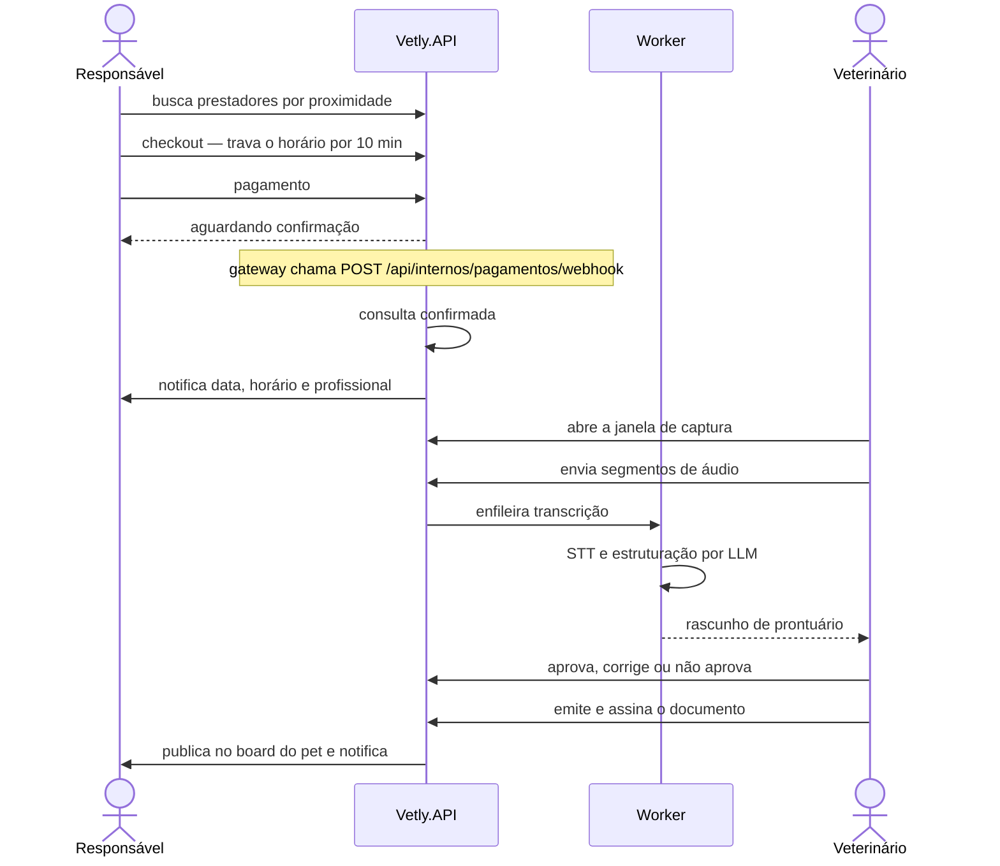

# Vetly API

**Plataforma que conecta responsáveis de pets a clínicas e veterinários autônomos — agendamento, pagamento com split, prontuário assistido por IA e fidelidade em uma única API.**

`.NET 10` · `ASP.NET Core` · `EF Core 10` · `Oracle` · `Docker` · `1.080 testes automatizados`

O ciclo completo do produto vive aqui: busca por proximidade, agenda com controle de concorrência, cobrança antecipada, captura de áudio da consulta, estruturação do prontuário por LLM, emissão de documentos assinados e programa de pontos.

A tese que organiza o código é uma só: **o prontuário pertence ao animal, não à clínica.** Dela decorrem o consentimento granular, a autorização de acesso com prazo e escopo, e a trilha de acesso append-only visível ao responsável.

Esta é uma implementação de **MVP**, e o código diz isso abertamente. Não há gateway de pagamento real — a cobrança é simulada, e nota fiscal e split são registrados, não liquidados. Toda dependência externa entra por uma **porta** na camada de Aplicação e sai por um adaptador escolhido em configuração; trocar simulado por real é trocar um registro no contêiner de DI.

---

## 1. Início rápido

### Pré-requisitos

| Requisito | Necessidade |
|---|---|
| .NET 10 SDK | obrigatório |
| Oracle 21c+ | obrigatório |
| [Ollama](https://ollama.com) com `llama3.1` | **opcional** — sem ele apenas as rotas `/api/ia` param e `/health/ready` responde `Degraded` |

### Configuração

Crie `src/Vetly.API/appsettings.Development.local.json` — o padrão `appsettings.*.local.json` já está no [.gitignore](.gitignore), então o arquivo não vai para o repositório:

```json
{
  "ConnectionStrings": {
    "OracleConnection": "User Id=USUARIO;Password=SENHA;Data Source=host:1521/orcl"
  },
  "Jwt": {
    "Key": "uma-chave-com-no-minimo-32-caracteres"
  },
  "Servicos": {
    "TokenInterno": "um-token-qualquer-para-as-rotas-internas"
  }
}
```

`Servicos:TokenInterno` autentica as rotas `POST /api/internos/*` (webhook de pagamento e callback de transcrição). Sem ele configurado, essas rotas recusam tudo — falhar fechado é melhor que aceitar evento de qualquer origem.

O `appsettings.json` versionado traz **placeholders** nesses três valores, para que o formato esperado fique visível a quem clona o repositório. Em `Development` eles seguem valendo; em `Production`, [GuardaDeSegredos](src/Vetly.API/Security/GuardaDeSegredos.cs) **recusa o arranque** se algum deles ainda for o valor de exemplo, ou se a `Jwt:Key` tiver menos de 32 caracteres — HMAC-SHA256 exige 256 bits, e sem a guarda uma chave curta só falharia no primeiro login. Ver [§7 Deploy](#7-deploy).

### Execução

```bash
dotnet restore
dotnet ef database update --project src/Vetly.Infrastructure --startup-project src/Vetly.API
dotnet run --project src/Vetly.API --launch-profile https
```

As migrations **não** são aplicadas na inicialização: não há `Database.Migrate()` no código. O passo é manual e deliberado — nenhuma instância altera o schema por conta própria ao subir, e com várias réplicas seria cada uma tentando ao mesmo tempo.

Para usar o Azure Speech (`Adaptadores:Stt=Azure`), a chave vem **só** de variável de ambiente — nunca de arquivo do repositório. O .NET não lê arquivos `.env`: exporte no shell ou passe ao container.

```bash
export AZURE_SPEECH_KEY="sua-chave"
export AZURE_SPEECH_REGION="canadacentral"      # ou Azure:Speech:Region no appsettings
```

### Endereços

| URL | O que é |
|---|---|
| `https://localhost:7262/scalar/v1` | Documentação interativa (Scalar) |
| `https://localhost:7262/openapi/v1.json` | Documento OpenAPI |
| `/health` · `/health/live` · `/health/ready` | Health checks (todos · liveness · readiness) |
| `/metrics` | Métricas em formato Prometheus |

Porta HTTP alternativa: `5140` (perfil `http`), definida em [launchSettings.json](src/Vetly.API/Properties/launchSettings.json).

### Testes

```bash
dotnet test
```

Roda numa máquina recém-clonada, **sem Oracle e sem Ollama** — os testes de integração sobem a API em memória e os adaptadores default são simulados.

---

## 2. Arquitetura

Quatro camadas, com a regra de dependência apontando sempre para dentro.


Nenhuma seta sai do `Domain`. Ele não referencia projeto nem pacote algum — nem EF Core, nem as abstrações de logging da Microsoft. O mapeamento para o Oracle vive inteiramente na Infrastructure, em classes `IEntityTypeConfiguration<T>`.

| Camada | Conteúdo | Referencia |
|---|---|---|
| **Vetly.API** | 24 controllers (152 endpoints), 3 filtros globais, 3 middlewares, 4 health checks, worker hospedado | Application, Infrastructure |
| **Vetly.Infrastructure** | EF Core + Oracle, 33 DbSets, 34 migrations, 27 configurations, 24 repositórios, 9 adaptadores | Application, Domain |
| **Vetly.Application** | 29 serviços, 62 interfaces, 72 arquivos de DTO | Domain + 2 pacotes `*.Abstractions` |
| **Vetly.Domain** | 31 entidades, 42 enums, 7 value objects | **nada** |

### Portas e adaptadores

Tudo que a Aplicação precisa do mundo externo é declarado como interface em [Interfaces/](src/Vetly.Application/Interfaces/) e implementado em [Adapters/](src/Vetly.Infrastructure/Adapters/). A escolha da implementação é feita por configuração, no arranque.

| Chave | Padrão | Valores aceitos |
|---|---|---|
| `Adaptadores:Stt` | `Simulado` | `Simulado`, `NodeRed`, `Azure` |
| `Adaptadores:Storage` | `Local` | `Local` |
| `Adaptadores:Assinatura` | `NomeDigitado` | `NomeDigitado` |
| `Adaptadores:Pagamento` | `Simulado` | `Simulado` |
| `Adaptadores:Crmv` | `Simulado` | `Simulado` |
| `Adaptadores:Push` | `Simulado` | `Simulado` |
| `Adaptadores:Geocodificacao` | `Simulado` | `Simulado` |

Um valor não reconhecido **derruba a aplicação no arranque**. Não existe fallback silencioso: uma configuração errada falha no deploy, não em produção às três da manhã.

### Padrões de projeto

| Padrão | Onde | O que resolve |
|---|---|---|
| **Strategy** | [Strategies/Cancelamento/](src/Vetly.Application/Strategies/Cancelamento/) | Reembolso por faixa de antecedência. A mesma strategy atende a simulação e o cancelamento real — mostrar um valor e cobrar outro fica impossível por construção |
| **Strategy + Template Method** | [Strategies/Split/](src/Vetly.Application/Strategies/Split/) | Take rate por plano. A classe base concentra a aritmética e deriva o repasse por subtração, para comissão e repasse sempre somarem o bruto |
| **Factory** | [Factories/](src/Vetly.Application/Factories/) | Prontuário, receita, atestado e nota fiscal. A factory formata o estado final aprovado; não infere conteúdo clínico |
| **Repository** | [Repositories/](src/Vetly.Infrastructure/Repositories/) | `IRepositoryBase<T>` genérico + 23 concretos. O de auditoria de IA não expõe update nem delete |

### Estrutura

```
src/
├── Vetly.Domain/           Entities · Enums · ValueObjects
├── Vetly.Application/      Services · Interfaces · DTOs · Factories
│                           Strategies · Exceptions · Observability
├── Vetly.Infrastructure/   Data (DbContext, Configurations) · Migrations
│                           Repositories · Adapters · Jobs · Security
└── Vetly.API/              Controllers · Filters · Middlewares
                            HealthChecks · Observability · Jobs · Security
tests/
├── Vetly.UnitTests/        45 arquivos — regras de negócio isoladas
└── Vetly.IntegrationTests/ 31 arquivos — API completa em memória
```

---

## 3. Fluxo do atendimento

O caminho crítico, do agendamento ao documento publicado:



- **A confirmação do pagamento vem só do webhook**, nunca da resposta síncrona da cobrança — e o aviso ao Responsável nasce no mesmo lugar, pela mesma razão: avisar antes prometeria uma consulta que o gateway ainda pode recusar.
- **A IA sugere; o veterinário decide.** Toda decisão vira registro append-only com o conteúdo final, o autor e o modelo usado.
- **Fora da janela de captura nada é gravado nem gerado.** Quem abre e fecha a janela é o veterinário.

Os onze eventos que o Responsável recebe in-app e por push, e o serviço que dispara cada um, estão mapeados em [REGRAS-DE-NEGOCIO.md](REGRAS-DE-NEGOCIO.md#a-matriz-de-canais-62-e-onde-cada-evento-nasce).

---

## 4. Autenticação

JWT Bearer com refresh token rotativo — cada uso invalida o anterior. Senhas em PBKDF2-HMAC-SHA256 com 210.000 iterações e salt por usuário.

| Perfil | Acesso |
|---|---|
| `Tutor` | Responsável pelo animal: busca, agenda, paga, autoriza acesso ao histórico, avalia |
| `Veterinario` | Agenda, atende, valida diagnóstico, emite e assina documentos |
| `Admin` | Administra a clínica: cadastra veterinários, define plano, painel e consolidado financeiro da unidade. **Não é cadastro à parte** — é o veterinário apontado em `Empresa.AdministradorId`, e a role é derivada desse vínculo no login (§4.1). Desativar o profissional rebaixa a role antes de qualquer outra coisa (RN-022) |
| `VetDesativado` | Bloqueado em toda rota de negócio; mantém apenas o próprio extrato |

As policies registradas são `ApenasAdmin`, `VeterinarioOuAdmin`, `ApenasTutor` e `TutorOuAdmin`.

**Escopo por linha, e não por policy.** A policy diz quem entra na rota; quem decide de quem são os dados é o serviço, lendo a identidade da claim (RN-105/RN-106). Onde a §7.3 veda um acesso ao próprio Admin — a conta bancária do veterinário vinculado, o painel de outra unidade —, a rota **não tem id**: sem parâmetro não há o que trocar, e a vedação deixa de depender de uma checagem que alguém pode remover.

Três filtros globais rodam antes de qualquer controller e **falham fechado** — na dúvida, negam: consentimento LGPD ([ConsentimentoAtendimentoFilter](src/Vetly.API/Filters/ConsentimentoAtendimentoFilter.cs)), bloqueio de veterinário desativado ([VetDesativadoFilter](src/Vetly.API/Filters/VetDesativadoFilter.cs)) e idempotência ([IdempotencyFilter](src/Vetly.API/Filters/IdempotencyFilter.cs)).

---

## 5. Observabilidade

| Check | Falha como | Tag |
|---|---|---|
| `api` | — | `live` |
| `oracle-db` | `Unhealthy` | `ready` |
| `ollama` | `Degraded` | `ready` |
| `azure-speech` | `Degraded` | `ready` (só com `Adaptadores:Stt=Azure`) |

Dependência de IA indisponível **degrada, não derruba**: a consulta continua acontecendo com prontuário manual.

Logs estruturados via Serilog em console e arquivo (`src/Vetly.API/logs/vetly-AAAAMMDD.log`, rotação diária, 14 dias retidos, JSON compacto). Traces e métricas via OpenTelemetry, expostos em `/metrics` no formato Prometheus; para enviar a um coletor externo, basta preencher `OpenTelemetry:Otlp:Endpoint`.

**Rastreabilidade de regra de negócio.** Quando uma regra é violada, a resposta traz um código no `ProblemDetails`:

```json
{ "status": 409, "codigo": "RN-035", "detail": "Horario ja reservado." }
```

Esse mesmo `RN-035` é a chave em [REGRAS-DE-NEGOCIO.md](REGRAS-DE-NEGOCIO.md) — onde a regra está descrita e a classe que a implementa está nomeada — e é o label da métrica `vetly_regras_violadas_total{codigo}`. Um alerta no Prometheus leva ao arquivo de código sem adivinhação no meio do caminho.

---

## 6. Testes

xUnit com Moq. Asserções nativas, sem biblioteca de fluência.

| Suíte | Arquivos | O que cobre |
|---|---|---|
| `Vetly.UnitTests` | 45 | Regras de negócio isoladas, um arquivo por serviço |
| `Vetly.IntegrationTests` | 31 | API real via `WebApplicationFactory` — pipeline, filtros, auth e worker |

```bash
dotnet test                                              # tudo
dotnet test tests/Vetly.UnitTests                        # uma suíte
dotnet test --filter "FullyQualifiedName~FidelidadeTests"

dotnet test --collect:"XPlat Code Coverage" --settings coverlet.runsettings
```

O [coverlet.runsettings](coverlet.runsettings) exclui as migrations geradas — sem esse filtro, ~7 mil linhas de código gerado afundam a cobertura da Infrastructure.

**O limite conhecido:** os testes de integração usam EF InMemory, que não traduz SQL **nem aplica o mapeamento de tipo do Oracle**. Duas classes de defeito passam por ele:

- LINQ válido que o provider Oracle não traduz — foi o caso de um `AnyAsync` que virou `ORA-00904`.
- Divergência entre o tipo da entidade e o que o provider resolve pela precisão da coluna: `NUMBER(4)` mapeia para *byte* e trunca módulo 256 na escrita, `NUMBER(1)` mapeia para *boolean*. No InMemory, 480 entra e 480 volta.

A defesa são duas guardas que inspecionam sem precisar de banco: [CompatibilidadeComOracleTests](tests/Vetly.UnitTests/CompatibilidadeComOracleTests.cs) varre o fonte atrás dos padrões que já quebraram, e [MapeamentoNumericoOracleTests](tests/Vetly.IntegrationTests/MapeamentoNumericoOracleTests.cs) constrói o modelo com o provider Oracle de verdade e falha quando uma propriedade `int` acaba mapeada para um tipo mais estreito. Mais o [validador de endpoints](deploy/validar-endpoints.py) contra um ambiente real antes de entregar.

---

## 7. Deploy

O alvo é **uma VM Linux com tudo dentro**: API, Ollama e proxy HTTPS no mesmo host, orquestrados por Docker Compose.

A escolha não é de arquitetura, é de restrição. O Ollama precisa de um processo residente com o modelo carregado na memória, e nenhum serviço gerenciado da Azure entrega isso barato — App Service e Container Apps cobram por manter memória de pé e não guardam o modelo entre execuções. Numa VM, a API fala com o Ollama pela rede interna do Compose, sem sair da máquina.

### O que fica exposto

Só a porta 443, no Caddy, que emite e renova o certificado sozinho. A API (8080) e o Ollama (11434) vivem na rede interna do Compose — **o Ollama não tem autenticação nenhuma**, e publicá-lo seria entregar um LLM aberto a quem passar.

### Provisionar

```powershell
./deploy/azure-vm-deploy.ps1 `
  -ConnectionStringOracle "User Id=...;Password=...;Data Source=oracle.fiap.com.br:1521/orcl"
```

O script é idempotente: rodar de novo reaproveita a VM, recopia o código e refaz o build — que é exatamente o que se quer num redeploy. Guarde o **sufixo** que ele imprime; é o que faz a próxima execução encontrar os recursos da anterior em vez de criar um conjunto novo.

`-SomenteAplicacao` pula o provisionamento e só atualiza o código.

| Parâmetro | Padrão | Nota |
|---|---|---|
| `-Regiao` | `canadacentral` | Precisa estar na policy `Allowed resource deployment regions` da assinatura |
| `-TamanhoDaVm` | `Standard_D4as_v4` | 4 vCPU / 16 GB. Ver o dimensionamento abaixo |
| `-ModeloDeIa` | `llama3.1` | O mesmo do `appsettings.json` |
| `-AzureSpeechKey` | — | Sem ela, o STT fica em `Simulado` |

### Dimensionamento — por que 16 GB

O `llama3.1` de 8B quantizado ocupa 5–6 GB só de modelo. Com 8 GB de RAM total, sobrariam menos de 2 GB para a API, o Caddy e o sistema — funciona até a primeira inferência concorrente. Medido em produção: a VM usa ~10 dos 16 GB com tudo no ar.

A família é **dedicada e não burstable** de propósito: inferência é carga sustentada, e numa B-series os créditos acabam justamente quando a máquina está em uso. Vale conferir o preço antes de trocar — em Canada Central o `B4ms` custa **mais** que o `D4as_v4`.

### Bootstrap do primeiro administrador

Administrador não é cadastro à parte: é o veterinário que a empresa aponta em `Empresa.AdministradorId`, e a role `Admin` é **derivada desse vínculo no login**. Isso cria um ovo-e-galinha no primeiro deploy — criar empresa exige ser Admin.

[SemeadorDoAdministrador](src/Vetly.API/Jobs/SemeadorDoAdministrador.cs) resolve por configuração:

```
Bootstrap__AdminEmail=admin@vetly.com.br
Bootstrap__AdminSenha=<uma-senha-forte>
Bootstrap__EmpresaNome=Clinica Vetly Central
```

Só age quando o e-mail está definido **e** não existe nenhuma unidade. Havendo qualquer empresa cadastrada, ele se cala — senão um redeploy ressuscitaria um acesso que alguém removeu de propósito. A senha nasce marcada como temporária, porque passou por variável de ambiente e log de deploy: troque-a por `POST /api/auth/trocar-senha` e remova `Bootstrap__AdminSenha` depois do primeiro arranque.

### Variáveis obrigatórias

O separador de chave aninhada no ambiente é `__` (dois underscores), não `:`.

| Variável | Por que |
|---|---|
| `ConnectionStrings__OracleConnection` | Sem banco a API não entrega nada — `/health/ready` responde 503 |
| `Jwt__Key` | Mínimo 32 caracteres. O arranque **recusa** a chave de exemplo do repositório |
| `Servicos__TokenInterno` | Autentica o webhook de pagamento e o callback de transcrição. Ausente, as rotas internas recusam tudo; de exemplo, o arranque recusa |
| `Storage__PublicBaseUrl` | A URL assinada é consumida de fora do processo. Ausente, a API não sobe |
| `AZURE_SPEECH_KEY` | Só com `Adaptadores__Stt=Azure`. Nunca vai para arquivo do repositório |

Um adaptador com valor não reconhecido também derruba o arranque. Não existe fallback silencioso: configuração errada falha no deploy, não em produção às três da manhã.

### Migrations

Aplicadas **fora** do host, antes de subir a versão nova. Não há `Database.Migrate()` no código: com mais de uma réplica, seria cada uma alterando o schema ao mesmo tempo.

```bash
dotnet ef database update --project src/Vetly.Infrastructure --startup-project src/Vetly.API
```

### Validar o ambiente

[validar-endpoints.py](deploy/validar-endpoints.py) percorre a API inteira contra um ambiente de verdade — autentica as três personas, encadeia o ciclo clínico completo e confere o status de cada rota:

```bash
python deploy/validar-endpoints.py https://seu-host <senha-do-admin>
python deploy/validar-endpoints.py https://seu-host <senha> --rapido   # pula as rotas de IA
```

Não substitui a suíte: ela prova regra de negócio isolada, e o validador prova que o conjunto sobe, se autentica e responde pelo caminho que o app percorre. Foi ele que encontrou o `[Required]` inócuo da busca e o truncamento de inteiro do Oracle — defeitos que a suíte não pegava porque roda sobre InMemory.

### Sondas

| Endpoint | Decide | Com Oracle fora |
|---|---|---|
| `/health/live` | reiniciar o container | 200 — reiniciar não levanta o banco |
| `/health/ready` | receber tráfego | 503 — sai de rotação |

### Custo

Preços de Canada Central, pay-as-you-go:

| Item | USD/mês |
|---|---|
| VM `Standard_D4as_v4` — $0,214/h | 156,22 |
| Disco StandardSSD 64 GB (E6) | 5,28 |
| IP público Standard estático | 3,65 |
| **Total 24/7** | **≈ 165** |

A maior alavanca é desligar quando não estiver usando:

```bash
az vm deallocate -g rg-vetly-vm -n vetly-vm-<sufixo>
az vm start      -g rg-vetly-vm -n vetly-vm-<sufixo>
```

Desalocada, restam ~US$ 9/mês (disco e IP, que continuam reservados). Usando 8h por dia útil, fica em ~US$ 46/mês.

### O que fica de fora desta entrega

`/metrics` e a documentação Scalar ficam públicos, como os health checks. Métrica agregada não carrega dado pessoal, mas revela volume de operação — em produção, restrinja os dois no nível do proxy.

---

## Documentos relacionados

[REGRAS-DE-NEGOCIO.md](REGRAS-DE-NEGOCIO.md) — catálogo RN-001 a RN-107, cada regra ligada à classe e ao método que a implementa.

[ROTEIRO-POSTMAN.md](ROTEIRO-POSTMAN.md) — a jornada completa no Postman, com os corpos de requisição prontos para copiar e colar.

Todo o código está em português, incluindo os XML docs, que explicam o *porquê* de cada decisão e não apenas o *o quê*.

Projeto acadêmico desenvolvido para a disciplina **Advanced Business Development with .NET**.
